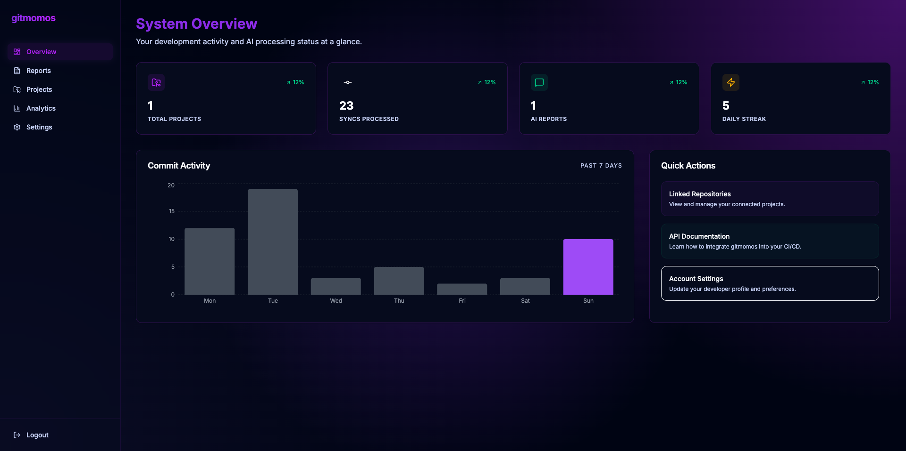
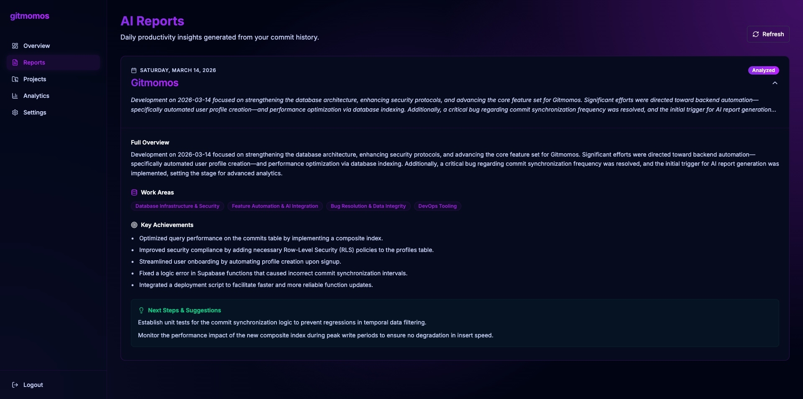
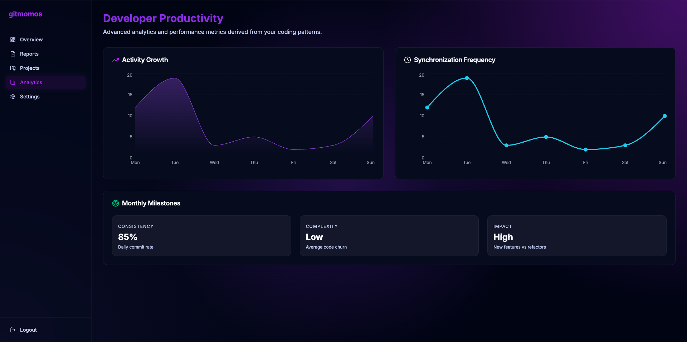
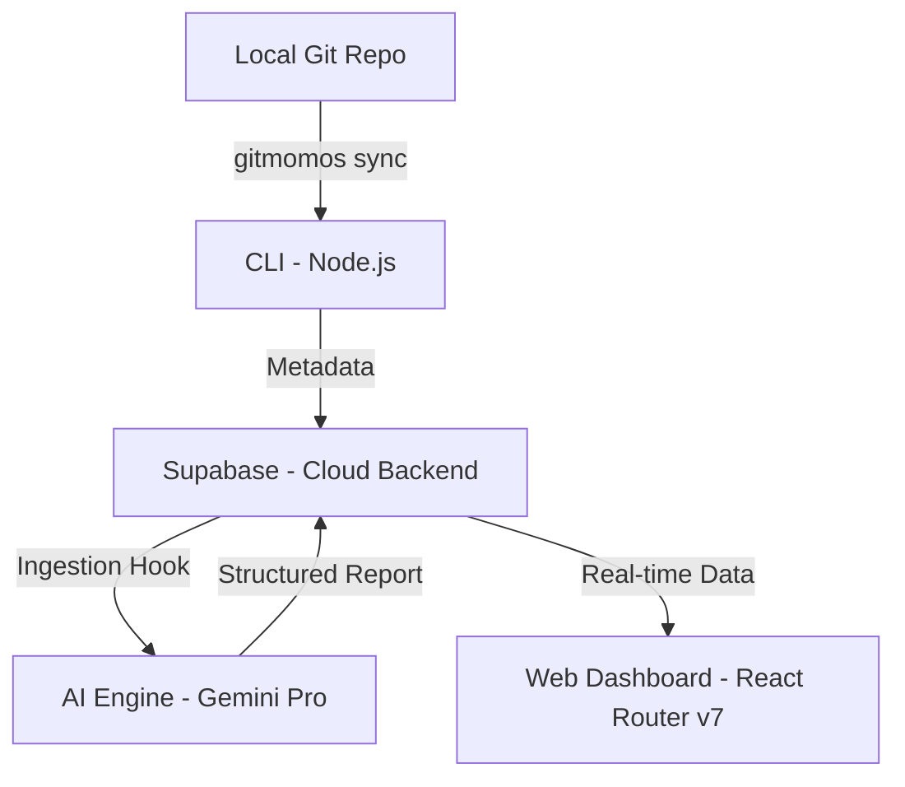

# gitmomos 🚀

**AI-powered developer productivity reports from your Git commits.**

Gitmomos is a professional developer productivity tool designed to bridge the gap between your daily coding activity and structured progress reporting. By securely syncing your Git commit metadata, Gitmomos uses advanced AI (Gemini Pro) to translate technical commit messages into cohesive, high-level developer reports.

## 🚧 Project Status

> **Note**
> Gitmomos is currently **under active development**.
>
> The **core user flow (golden path)** has been implemented and is functional. I am actively working on stabilizing the platform and preparing the first public release.
>
> A production release will be published once deployment and final polishing are completed.

If you encounter issues or have suggestions, feel free to open an issue.

---

## ✨ Features

- **🤖 AI-Powered Reports**: Automatically generate daily and weekly summaries from your Git activity.
- **📟 Terminal Native**: A powerful CLI to sync your workflow without leaving the terminal.
- **📊 Professional Dashboard**: Visualize your productivity trends, commit frequency, and key achievements.
- **🔒 Secure & Private**: Only commit metadata (messages, hashes, dates) is synced. Your source code never leaves your machine.
- **🛠 Easy Project Management**: Link multiple repositories and track them all in one place.
- **📝 Manual Overrides**: Edit AI-generated reports or add manual updates for non-coding tasks.

---

## 📸 Screenshots

### Dashboard Overview



### AI Reports



### Project Analytics



---

## 🏗 Architecture Overview

Gitmomos is built as a modern monorepo with a decoupled architecture:



- **CLI (`packages/cli`)**: A TypeScript-based terminal tool that extracts commit metadata and securely dispatches it to the cloud.
- **Cloud Backend (`supabase/`)**: Leverages Supabase for secure Auth, Postgres database, and Edge Functions for processing.
- **AI Engine**: A dedicated pipeline using Google's Gemini Pro to analyze technical activity and generate human-readable reports.
- **Web Dashboard (`apps/web`)**: A high-performance React application built with React Router v7, featuring Framer Motion animations and Recharts visualizations.

---

## 🚀 Getting Started

### Installation (CLI)

Install the Gitmomos CLI globally using npm:

```bash
npm install -g gitmomos
```

### Initial Setup

1. **Login**: Authenticate your CLI with your Gitmomos account.

    ```bash
    gitmomos login
    ```

2. **Add Project**: Link your current Git repository to the Gitmomos cloud.

    ```bash
    gitmomos add "My Awesome Project"
    ```

3. **Sync Work**: At the end of your session, sync your commits.
    ```bash
    gitmomos sync
    ```

---

## 📟 CLI Usage

| Command               | Description                                          |
| :-------------------- | :--------------------------------------------------- |
| `gitmomos login`      | Authenticate the CLI with your credentials.          |
| `gitmomos add [name]` | Link the current directory as a Gitmomos project.    |
| `gitmomos sync`       | Extract and push commit metadata to the cloud.       |
| `gitmomos logout`     | Securely clear your session from the local keychain. |
| `gitmomos --help`     | View all available commands and options.             |

---

## 🧠 How Reports Work

Gitmomos follows an asynchronous processing workflow to ensure maximum performance:

1. **Sync**: `gitmomos sync` extracts commit message, hash, and author date.
2. **Push**: Metadata is securely stored in the Supabase database.
3. **Analyze**: The AI Engine processes the metadata in the background (triggered by scheduled jobs).
4. **Visualize**: Reports appear on your dashboard once processing is complete.

---

## 🛠 Local Development

### Prerequisites

- Node.js (v18+)
- Yarn (v4.0.0+)
- Supabase CLI

### Setup

1. **Clone the repository**:

    ```bash
    git clone https://github.com/ravitejas-tech/gitmomos.git
    cd gitmomos
    ```

2. **Install dependencies**:

    ```bash
    yarn install
    ```

3. **Environment Setup**:
   Create a `.env` file in the root and in `apps/web/`:

    ```env
    SUPABASE_URL=your_supabase_url
    SUPABASE_ANON_KEY=your_supabase_anon_key
    GEMINI_API_KEY=your_gemini_api_key
    ```

4. **Run Development Mode**:
    ```bash
    yarn dev
    ```

### Project Structure

- `apps/web`: The React Router v7 dashboard.
- `packages/cli`: The Node.js CLI source code.
- `packages/shared`: Common TypeScript types and utilities.
- `supabase/`: Database schemas, migrations, and edge functions.

---

## 🤝 Contributing

Contributions are what make the open source community such an amazing place to learn, inspire, and create. Any contributions you make are **greatly appreciated**.

1. Fork the Project
2. Create your Feature Branch (`git checkout -b feature/AmazingFeature`)
3. Commit your Changes (`git commit -m 'Add some AmazingFeature'`)
4. Push to the Branch (`git push origin feature/AmazingFeature`)
5. Open a Pull Request

---

## 📄 License

Distributed under the MIT License. See `LICENSE` for more information.

---

<p align="center">
  Built with ❤️ by the Gitmomos Team
</p>
